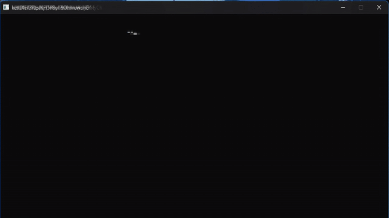

# 🎧 Discord Stereo Patcher

## 🧩 Description

**Discord Stereo Patcher** is a Windows console tool written in **C++17**.
It automatically detects installed versions of **Discord**, **Discord PTB**, and **Discord Canary**, then patches their `discord_voice` module by copying replacement files.

---



---

## ⚙️ Features

* 🔍 Auto-detects Discord installations.
* 🛑 (Optional) Closes Discord processes before patching.

---

## 📁 Project Structure

```
DiscordStereoPatcher/
├── installer.cpp               # Main source code
├── startup_sound.h        # Embedded MP3 array (launch_mp3, launch_mp3_len)
├── discord_voice/         # Replacement files to inject
└── build/                 # Optional build output
```

---

### Libraries

* `<windows.h>`
* `<filesystem>`
* `<mmsystem.h>` (for MCI audio playback)

## ⚠️ Disclaimer

This tool modifies Discord’s internal files.
Its use may violate **Discord’s Terms of Service**.
Use **only for educational or local testing purposes** on isolated installations.
The author is **not responsible** for bans or damages.

---

## 👤 Author

Created as an **educational demonstration** of Windows file operations, console UI, and embedded resource handling.
